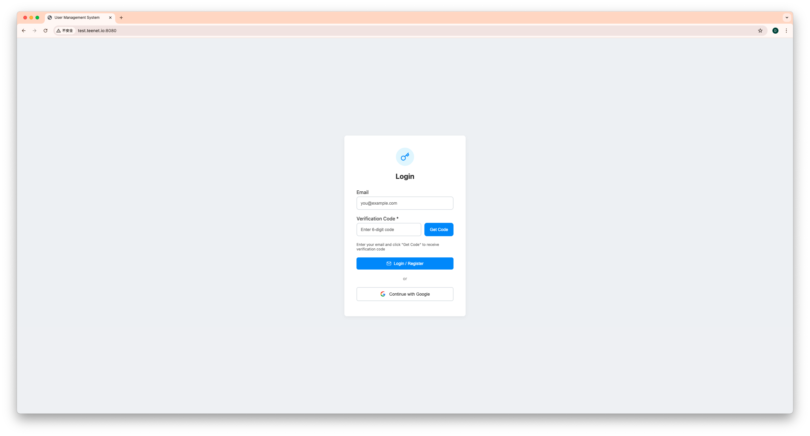
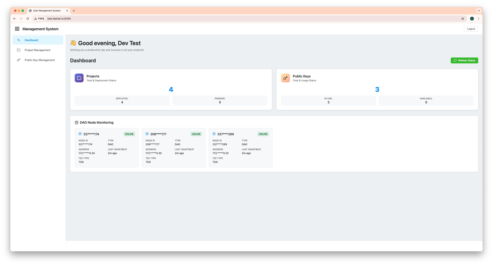
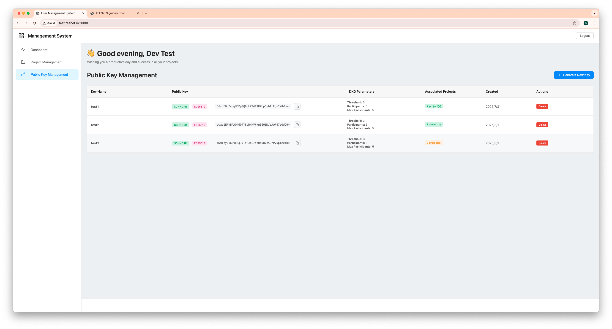
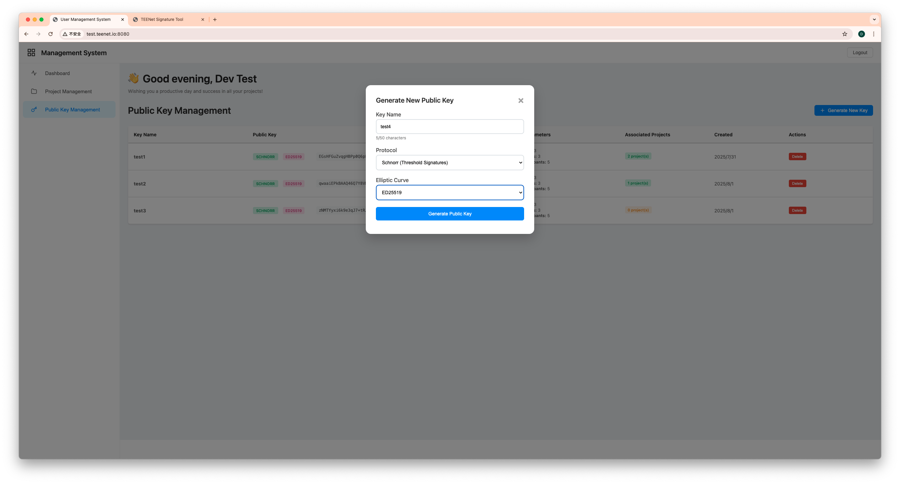
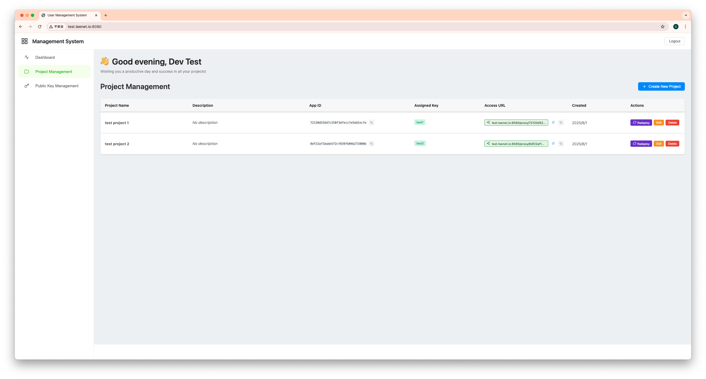
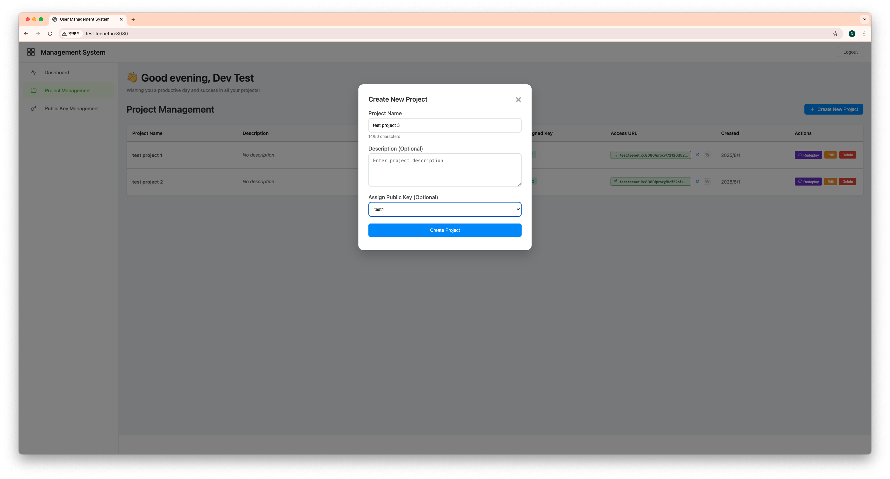
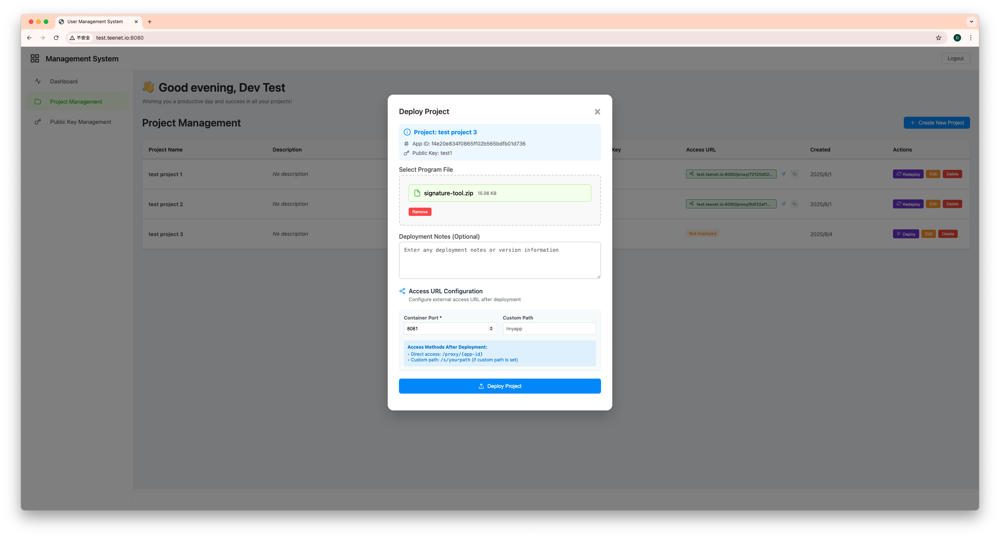
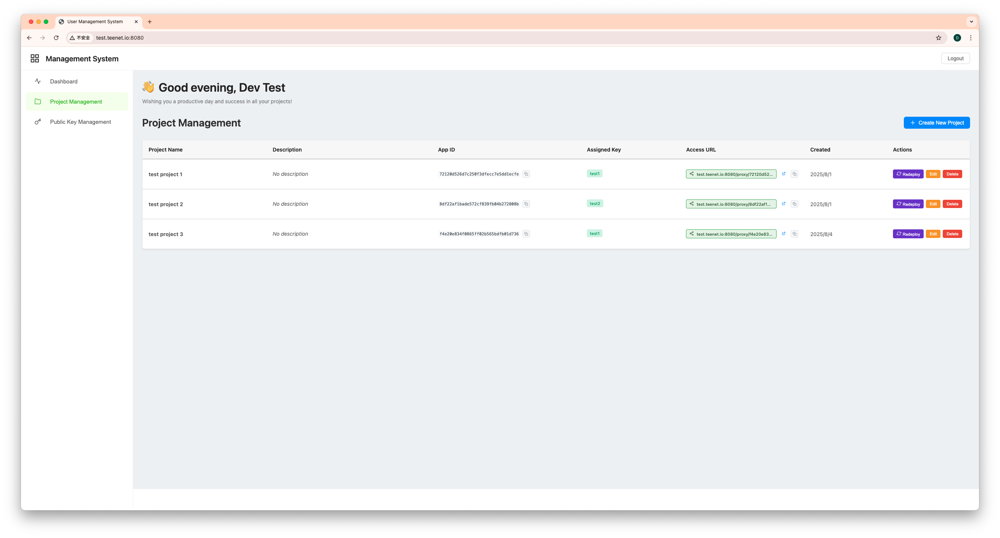
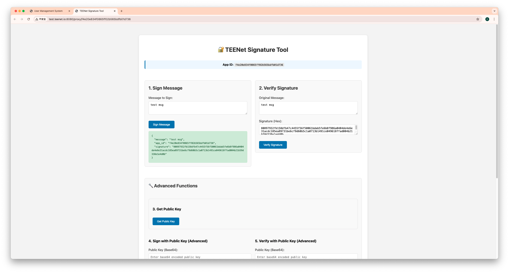
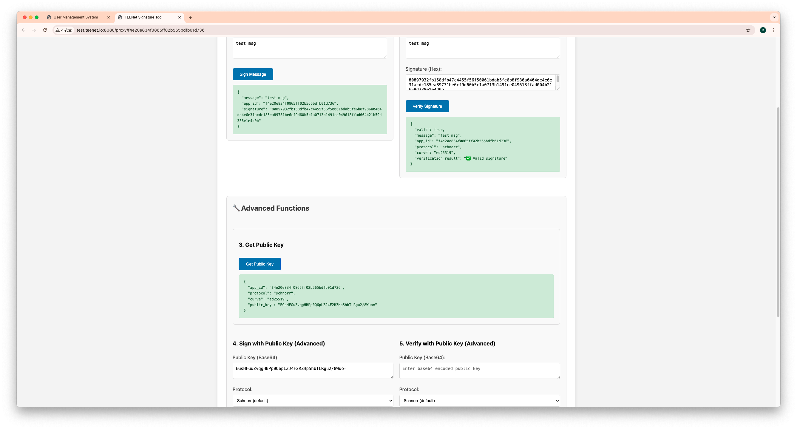

# TEE DAO System Usage Guide

## System Overview

The TEE DAO system is a complete distributed key management and application deployment platform that includes three core components:
- **TEE DAO Private Key Sharding System**: Provides secure distributed key generation and signing services
- **User Management System**: Provides users with a web interface for application deployment and key management
- **Client SDK**: Provides integration interfaces for developers

This guide will demonstrate how to use the system's various features through actual screenshots.

## Step 1: User Login



The system provides two login methods:

### Email Verification Code Login
1. Enter your email address (e.g., you@example.com)
2. Click the "Get Code" button to receive a 6-digit verification code
3. Check your email and enter the received verification code
4. Click "Login / Register" to complete login

### Google OAuth Login
1. Click the "Continue with Google" button
2. Select your Google account in the popup window
3. Complete login automatically after authorization

**Note**: The system supports account merging functionality. You can bind email verification and Google authentication to the same account.

## Step 2: View System Dashboard



After successful login, you will see the main system dashboard, displaying:

### Project Statistics
- **Projects**: Shows total number of projects and status distribution
  - DEPLOYED: Number of deployed projects
  - PENDING: Number of pending projects

### Public Key Statistics
- **Public Keys**: Shows total number of keys and usage status
  - IN USE: Number of keys currently in use
  - AVAILABLE: Number of available keys

### DAO Node Monitoring
Displays the status of nodes in the TEE DAO network:
- **Status**: ONLINE (online)
- **Type**: DAO node
- **TEE Type**: TDX (Intel TDX Trusted Execution Environment)
- **Last Heartbeat**: Real-time updated node health status

The "Refresh Status" button in the top right can refresh node status information.

## Step 3: Generate Keys (Recommended to Execute First)



Before creating projects, it's recommended to first generate the required keys. On the public key management page:

### View Existing Keys
The system displays all generated keys:

#### Key Information
- **Key Name**: Key name
- **Public Key**: Base64 encoded public key data
- **DKG Parameters**: Distributed key generation parameters
  - **Threshold**: Threshold (minimum number of signing nodes required)
  - **Participants**: Number of participants
  - **Max Participants**: Maximum number of participants

#### Protocol Information
- **Protocol**: Shows the signing protocol used
  - **SCHNORR**: Schnorr signature
  - **ED25519**: Elliptic curve type

#### Association Information
- **Associated Projects**: Shows the number of projects using this key

### Generate New Key



Click the "Generate New Key" button to generate a new key:

#### Basic Configuration
1. **Key Name**: Enter key name (e.g., test)
   - Used for identifying and managing keys

#### Protocol Selection
2. **Protocol**: Select signing protocol
   - **Schnorr (Threshold Signatures)**
   - **ECDSA**

#### Elliptic Curve Selection
3. **Elliptic Curve**: Select elliptic curve
   - **ED25519**
   - **SECP256K1**
   - **SECP256R1**

#### Generation Process
4. Click "Generate Public Key" button to start the key generation process

Key generation uses the Distributed Key Generation (DKG) protocol:
1. **Node Selection**: System automatically selects available TEE nodes
2. **Distributed Computation**: Multiple nodes collaborate to generate key shares
3. **Threshold Setting**: Default uses 3-of-5 threshold configuration
4. **Security Verification**: Verifies correctness of key shares
5. **Public Key Output**: Generates final public key for use

## Step 4: Project Management



With keys available, you can now create and manage projects:

### Project List Display
- **Project Name**: Project name
- **Description**: Project description
- **App ID**: Unique 32-bit identifier for each project
- **Assigned Key**: Key assigned to the project
- **Access URL**: Project access address
- **Created**: Project creation time
- **Actions**: Action buttons
  - **Deploy/Redeploy**: Deploy project/redeploy project
  - **Edit**: Edit project information
  - **Delete**: Delete project

### Create New Project
Click the "Create New Project" button in the top right to create a new project.

## Step 5: Create New Project



Steps to create a new project:

### Basic Information
1. **Project Name**: Enter project name (e.g., test project)
   - Maximum 50 characters
2. **Description (Optional)**: Enter project description
   - Optional field for detailed project purpose description

### Key Assignment
3. **Assign Public Key (Optional)**: Select public key to assign to the project
   - Dropdown menu shows available keys (e.g., test1)
   - **Important**: Select the key generated earlier

### Complete Creation
4. Click "Create Project" button to complete project creation

After project creation, a unique App ID will be automatically assigned for subsequent deployment and signing operations.

## Step 6: Deploy Application



Steps to deploy application to the TEE DAO network:
Example application: https://github.com/TEENet-io/tee-dao-key-management-client/tree/main/go/example/signature-tool

### Project Information Confirmation
- **Project**: Select project to deploy (e.g., test project)
- **App ID**: Shows the project's unique identifier
- **Public Key**: Shows the assigned signing key

### Upload Program File
1. **Select Program File**: Select application file to deploy
   - Supported formats: ZIP, TAR, JAR, WAR
   - Maximum file size: 100MB

### Deployment Notes
2. **Deployment Notes (Optional)**: Enter deployment notes
   - Can record version information or deployment considerations

### Access Configuration
3. **Access URL Configuration**: Configure service access method
   - **Container Port**: Set container port (e.g., 8081)
   - **Custom Path**: Set custom path (e.g., /myapp)

### Access Method Description
The system shows two access methods:
- **Direct access**: Direct access (http://test.teenet.io:8080/proxy/app_id)
- **Custom path**: Custom path (if custom path is set)

### Start Deployment
4. Click "Deploy Project" button to start deployment process

The deployment process will push application files to selected mesh nodes, build Docker images and start containers.

## Step 7: View Project Status



After deployment completion, the project list will update to show:

### Project Status
- **test project 3**: Newly created project displayed in the list
- **Status Indicator**: "Not Deployed" indicates project is created but not deployed, or deployment is in progress
- **App ID**: Shows complete 32-bit application identifier
- **Access URL**: Shows project access address

### Action Buttons
Each project has corresponding action buttons:
- **Redeploy**: Redeploy application
- **Edit**: Edit project information
- **Delete**: Delete project

The deployment process typically takes several minutes, including file transfer, Docker image building, and container startup.

## Step 8: Use SDK
SDK: https://github.com/TEENet-io/tee-dao-key-management-client/tree/main
Example application: https://github.com/TEENet-io/tee-dao-key-management-client/tree/main/go/example/signature-tool
After successful deployment, you can use the TEENet signature tool:

### Access Signature Tool
- Open the signature tool through the project's access URL




## System Integration Workflow

### Recommended Usage Workflow
```
User Login → Generate Keys → Create Project → Assign Keys to Project → 
Upload Application Files → Deploy to Mesh Nodes → Application Uses Signing Function → Verify Signature Results
```

### TEE Network Collaboration
1. **Key Generation**: Multiple TEE nodes collaborate to generate distributed keys
2. **Signing Operations**: Threshold number of nodes participate in signing process
3. **Security Guarantee**: Private keys never exposed in single location
4. **High Availability**: Supports node failure and network partition recovery

## Best Practices

### Key Management Priority
- **Generate Keys First**: Pre-generate required keys before creating projects
- **Meaningful Naming**: Use meaningful key names for easy management
- **Backup Strategy**: Ensure secure backup of key information

### Project Planning
- **Key Assignment**: Assign dedicated keys for each project
- **Version Management**: Add version notes for each deployment
- **Test Verification**: Fully test application functionality before deployment
- **Resource Configuration**: Configure appropriate resources based on application requirements

## Troubleshooting

### Common Issues
1. **Login Failure**: Check email address and verification code
2. **Key Generation Failure**: Confirm TEE node status is normal
3. **Deployment Failure**: Confirm file format and size limits
4. **Signing Errors**: Verify key configuration and network connection
5. **Access Issues**: Check firewall and port configuration

### Support Channels
- **Online Documentation**: Consult complete technical documentation
- **Community Forum**: Participate in developer community discussions
- **Technical Support**: Contact TEENet technical support team
- **GitHub Repository**: Submit issues and suggestion feedback

Through this guide, you can fully utilize the various features of the TEE DAO system to achieve secure distributed key management and application deployment. Remember, generating keys first before creating projects is the recommended best practice!