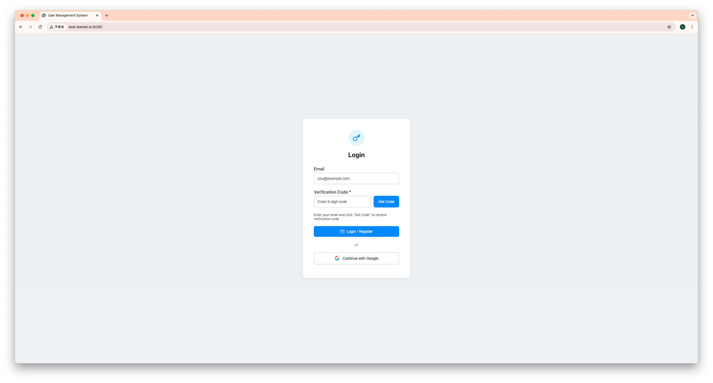
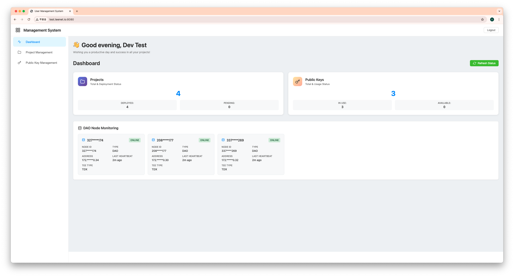
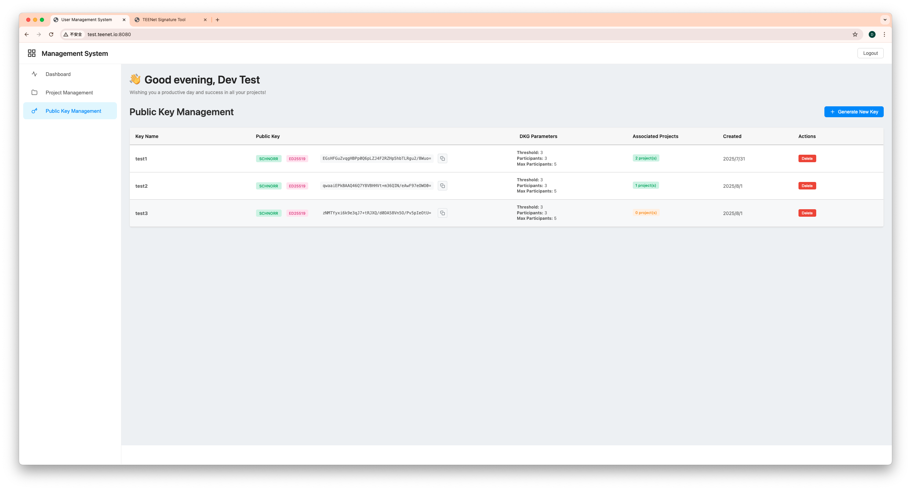
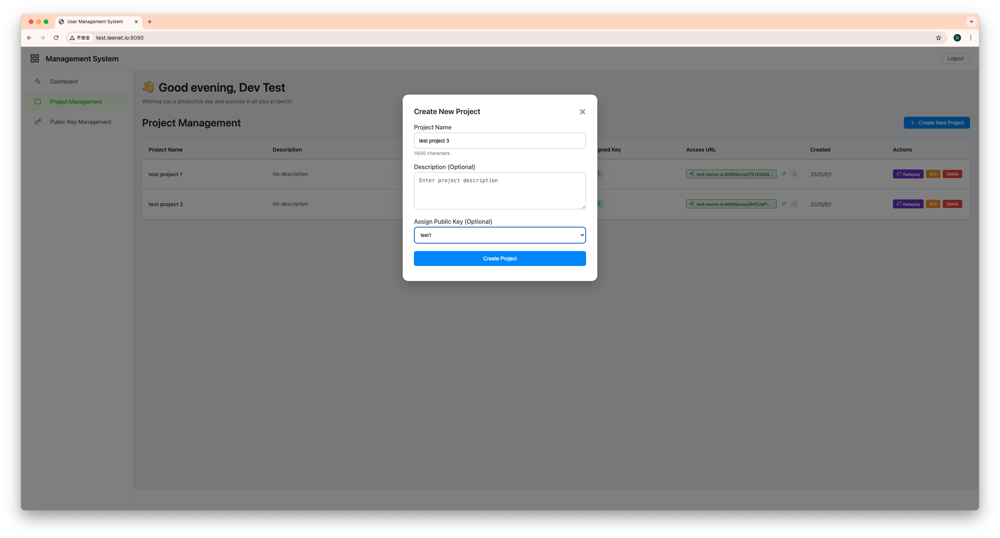
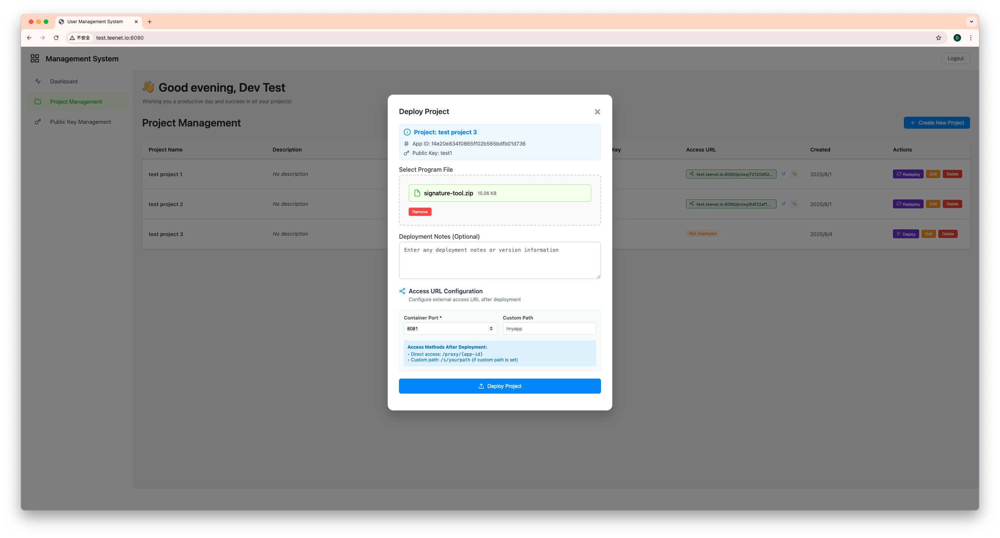
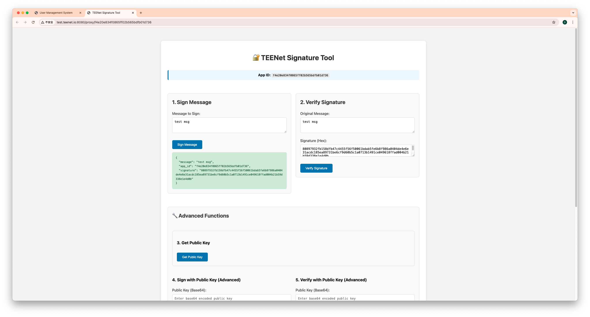
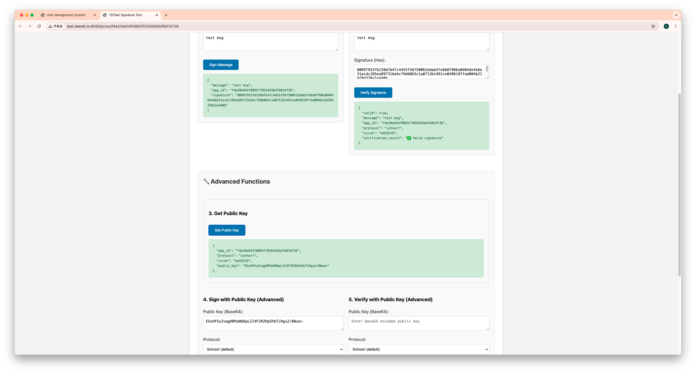

# TEE DAO 系统使用指南

## 系统概述

TEE DAO 系统是一个完整的分布式密钥管理和应用部署平台，包含三个核心组件：
- **TEE DAO 私钥分片存储系统**：提供安全的分布式密钥生成和签名服务
- **用户管理系统**：为用户提供 Web 界面进行应用部署和密钥管理
- **客户端 SDK**：为开发者提供集成接口

本指南将通过实际截图演示如何使用系统的各项功能。

## 第一步：用户登录



系统提供两种登录方式：

### 邮箱验证码登录
1. 输入您的邮箱地址（如：you@example.com）
2. 点击"Get Code"按钮获取 6 位数验证码
3. 检查邮箱并输入收到的验证码
4. 点击"Login / Register"完成登录

### Google OAuth 登录
1. 点击"Continue with Google"按钮
2. 在弹出窗口中选择您的 Google 账户
3. 授权后自动完成登录

**注意**：系统支持账户合并功能，您可以将邮箱验证和 Google 认证绑定到同一账户。

## 第二步：查看系统仪表板



登录成功后，您将看到系统主仪表板，显示：

### 项目统计
- **Projects**: 显示项目总数和状态分布
  - DEPLOYED: 已部署的项目数量
  - PENDING: 待部署的项目数量

### 公钥统计  
- **Public Keys**: 显示密钥总数和使用状态
  - IN USE: 正在使用的密钥数量
  - AVAILABLE: 可用的密钥数量

### DAO 节点监控
显示 TEE DAO 网络中的节点状态：
- **状态**: ONLINE（在线）
- **类型**: DAO 节点
- **TEE 类型**: TDX（Intel TDX 可信执行环境）
- **最后心跳**: 实时更新的节点健康状态

右上角的"Refresh Status"按钮可以刷新节点状态信息。

## 第三步：生成密钥（推荐首先执行）



在创建项目之前，建议先生成所需的密钥。在公钥管理页面：

### 查看现有密钥
系统显示所有已生成的密钥：

#### 密钥信息
- **Key Name**: 密钥名称
- **Public Key**: 公钥数据的 Base64 编码
- **DKG Parameters**: 分布式密钥生成参数
  - **Threshold**: 阈值（需要的最少签名节点数）
  - **Participants**: 参与者数量
  - **Max Participants**: 最大参与者数量

#### 协议信息
- **Protocol**: 显示使用的签名协议
  - **SCHNORR**: Schnorr 签名
  - **ED25519**: 椭圆曲线类型

#### 关联信息
- **Associated Projects**: 显示使用该密钥的项目数量

### 生成新密钥


点击"Generate New Key"按钮生成新密钥：

#### 基本配置
1. **Key Name**: 输入密钥名称（如：test）
   - 用于识别和管理密钥

#### 协议选择
2. **Protocol**: 选择签名协议
   - **Schnorr (Threshold Signatures)**
   - **ECDSA**

#### 椭圆曲线选择  
3. **Elliptic Curve**: 选择椭圆曲线
   - **ED25519**
   - **SECP256K1**
- **SECP256R1**

#### 生成过程
4. 点击"Generate Public Key"按钮开始密钥生成过程

密钥生成使用分布式密钥生成（DKG）协议：
1. **节点选择**: 系统自动选择可用的 TEE 节点
2. **分布式计算**: 多个节点协作生成密钥分片
3. **阈值设置**: 默认使用 3-of-5 阈值配置
4. **安全验证**: 验证密钥分片的正确性
5. **公钥输出**: 生成最终的公钥供使用

## 第四步：项目管理


有了密钥后，现在可以创建和管理项目：

### 项目列表显示
- **Project Name**: 项目名称
- **Description**: 项目描述
- **App ID**: 每个项目的唯一 32 位标识符
- **Assigned Key**: 分配给项目的密钥
- **Access URL**: 项目的访问地址
- **Created**: 项目创建时间
- **Actions**: 操作按钮
  - **Deploy/Redeploy**: 部署项目/重新部署项目
  - **Edit**: 编辑项目信息  
  - **Delete**: 删除项目

### 创建新项目
点击右上角的"Create New Project"按钮可以创建新项目。

## 第五步：创建新项目



创建新项目的步骤：

### 基本信息
1. **Project Name**: 输入项目名称（如：test project）
   - 最多 50 个字符
2. **Description (Optional)**: 输入项目描述
   - 可选字段，用于详细说明项目用途

### 密钥分配
3. **Assign Public Key (Optional)**: 选择要分配给项目的公钥
   - 下拉菜单显示可用的密钥（如：test1）
   - **重要**: 选择之前生成的密钥

### 完成创建
4. 点击"Create Project"按钮完成项目创建

项目创建后会自动分配一个唯一的 App ID，用于后续的部署和签名操作。

## 第六步：部署应用



部署应用到 TEE DAO 网络的步骤：
示例应用：https://github.com/TEENet-io/tee-dao-key-management-client/tree/main/go/example/signature-tool

### 项目信息确认
- **Project**: 选择要部署的项目（如：test project）
- **App ID**: 显示项目的唯一标识符
- **Public Key**: 显示分配的签名密钥

### 上传程序文件
1. **Select Program File**: 选择要部署的应用文件
   - 支持格式：ZIP, TAR, JAR, WAR
   - 最大文件大小：100MB

### 部署说明
2. **Deployment Notes (Optional)**: 输入部署说明
   - 可以记录版本信息或部署注意事项

### 访问配置
3. **Access URL Configuration**: 配置服务访问方式
   - **Container Port**: 设置容器端口（如：8081）
   - **Custom Path**: 设置自定义路径（如：/myapp）
   
### 访问方式说明
系统显示了两种访问方式：
- **Direct access**: 直接访问（http://test.teenet.io:8080/proxy/app_id）
- **Custom path**: 自定义路径（如果设置了自定义路径）

### 开始部署
4. 点击"Deploy Project"按钮开始部署流程

部署过程会将应用文件推送到选定的mesh节点，构建 Docker 镜像并启动容器。

## 第七步：查看项目状态


部署完成后，项目列表会更新显示：

### 项目状态
- **test project 3**: 新创建的项目已显示在列表中
- **状态标识**: "Not Deployed" 表示项目已创建但未部署，或部署正在进行中
- **App ID**: 显示完整的 32 位应用标识符
- **Access URL**: 显示项目的访问地址

### 操作按钮
每个项目都有相应的操作按钮：
- **Redeploy**: 重新部署应用
- **Edit**: 编辑项目信息
- **Delete**: 删除项目

部署过程通常需要几分钟时间，包括文件传输、Docker 镜像构建和容器启动。

## 第八步：使用sdk
sdk: https://github.com/TEENet-io/tee-dao-key-management-client/tree/main
示例应用：https://github.com/TEENet-io/tee-dao-key-management-client/tree/main/go/example/signature-tool
部署成功后，您可以使用 TEENet 签名工具：

### 访问签名工具
- 通过项目的访问 URL 打开签名工具





## 系统集成流程

### 推荐的使用流程
```
用户登录 → 生成密钥 → 创建项目 → 分配密钥给项目 → 
上传应用文件 → 部署到mesh节点 → 应用使用签名功能 → 验证签名结果
```

### TEE 网络协作
1. **密钥生成**: 多个 TEE 节点协作生成分布式密钥
2. **签名操作**: 阈值数量的节点参与签名过程
3. **安全保障**: 私钥永不在单一位置暴露
4. **高可用性**: 支持节点故障和网络分区恢复

## 最佳实践

### 密钥管理优先
- **先生成密钥**: 在创建项目前预先生成所需密钥
- **合理命名**: 使用有意义的密钥名称便于管理
- **备份策略**: 确保密钥信息的安全备份

### 项目规划
- **密钥分配**: 为每个项目分配专用密钥
- **版本管理**: 为每次部署添加版本说明
- **测试验证**: 部署前充分测试应用功能
- **资源配置**: 根据应用需求配置合适的资源

## 故障排除

### 常见问题
1. **登录失败**: 检查邮箱地址和验证码
2. **密钥生成失败**: 确认 TEE 节点状态正常
3. **部署失败**: 确认文件格式和大小限制
4. **签名错误**: 验证密钥配置和网络连接
5. **访问问题**: 检查防火墙和端口配置

### 支持渠道
- **在线文档**: 查阅完整的技术文档
- **社区论坛**: 参与开发者社区讨论
- **技术支持**: 联系 TEENet 技术支持团队
- **GitHub 仓库**: 提交问题和建议反馈

通过本指南，您可以充分利用 TEE DAO 系统的各项功能，实现安全的分布式密钥管理和应用部署。记住，先生成密钥再创建项目是推荐的最佳实践！